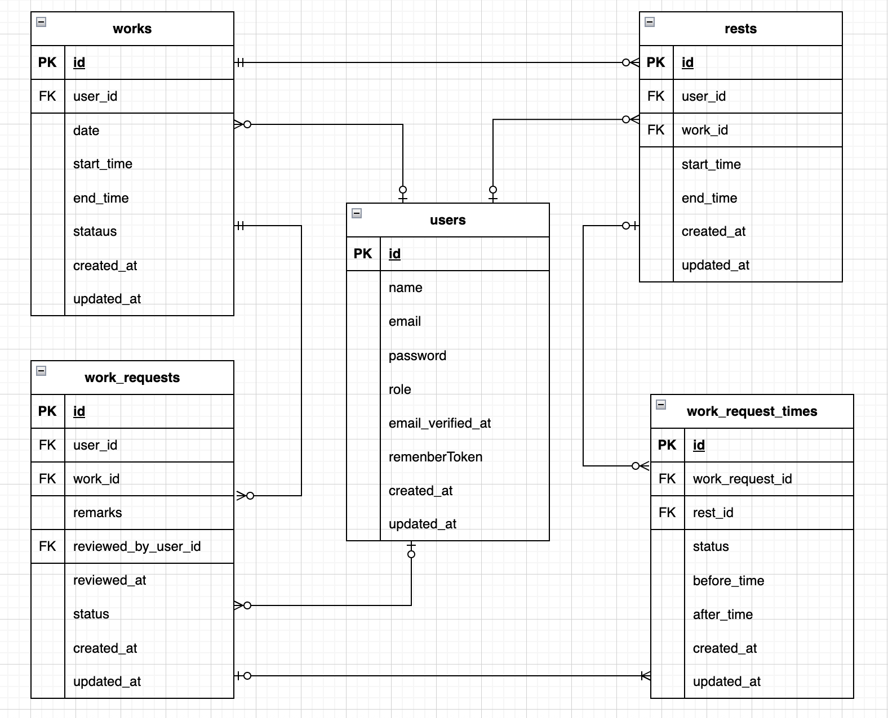

# 勤怠管理アプリ

## 環境構築
**Dockerビルド**
1. リポジトリをクローン
``` bash
git clone git@github.com:shiba013/attendance-management.git
```
2. ディレクトリに移動
``` bash
cd attendance-management
```
3. DockerDesktopアプリを立ち上げる
4. Dockerイメージのビルドとコンテナ起動
``` bash
docker-compose up -d --build
```

> *MacPCの場合、`no matching manifest for linux/arm64/v8 in the manifest list entries`のメッセージが表示されビルドができないことがあります。
エラーが発生する場合は、docker-compose.ymlファイルの「mysql」内に「platform」の項目を追加で記載してください*
``` bash
mysql:
    platform: linux/x86_64(この文追加)
    image: mysql:8.0.26
    environment:
```

**Laravel環境構築**
1. PHPコンテナに入る
``` bash
docker-compose exec php bash
```
2. Composerをインストールする
``` bash
composer install
```
3. 「.env.example」ファイルを 「.env」ファイルに命名を変更。または、新しく.envファイルを作成
``` bash
cp .env.example .env
```
4. .envに以下の環境変数を追加
``` text
DB_CONNECTION=mysql
DB_HOST=mysql
DB_PORT=3306
DB_DATABASE=laravel_db
DB_USERNAME=laravel_user
DB_PASSWORD=laravel_pass
```
5. アプリケーションキーの作成
``` bash
php artisan key:generate
```
6. マイグレーションの実行
``` bash
php artisan migrate
```
7. シーディングの実行
``` bash
php artisan db:seed
```

**認証メールアドレスの設定**
mailtrapというツールを使用しています。<br>
以下のリンクから会員登録をしてください。<br>
https://mailtrap.io/

メールボックスのIntegrationsから 「laravel 7.x and 8.x」を選択し、<br>
.envファイルのMAIL_MAILERからMAIL_ENCRYPTIONまでの項目をコピー＆ペーストしてください。<br>
MAIL_FROM_ADDRESSは任意のメールアドレスを入力してください。<br>
MAIL_FROM_NAMEは任意の送信者の名前（メールの送信者に表示される名前）を入力してください。<br>
設定完了後、キャッシュクリアを実行してください。<br>
``` bash
php artisan config:clear
```

## 単体テスト
**テスト環境構築**
1. MYSQLコンテナに入る
``` bash
docker-compose exec mysql bash
```
2. MySQLにrootユーザーでログイン（パスワードはrootと入力）
``` bash
mysql -u root -p
```
3. テスト用データベースを作成
``` bash
create database test;
exit;
```
4. PHPコンテナに入る
``` bash
docker-compose exec php bash
```
5. テスト環境用のアプリケーションキーを生成
``` bash
php artisan key:generate --env=testing
```
6. 設定キャッシュをクリア
``` bash
php artisan config:clear
```
7. テスト環境のマイグレーションをリフレッシュ
``` bash
php artisan migrate:fresh --env=testing
```
8. テストの実行
``` bash
./vendor/bin/phpunit
```

**テストアカウント**
``` text
-------------------------
name: user
email: user@example.com
password: user1234
権限: 一般ユーザ
-------------------------
name: general
email: general@example.com
password: general1234
権限: 一般ユーザ
-------------------------
name: admin
email: admin@example.com
password: admin1234
権限: 管理者
-------------------------
```

## 動作確認時の注意事項
**バリデーションメッセージ**
一般ユーザの勤怠詳細情報申請機能および管理者の勤怠詳細情報修正機能において、<br>
表示されるエラーメッセージを一部変更しました。<br>
- 出勤時間が退勤時間よりも後になっている場合: 出勤もしくは退勤時間が不適切な値です
- 休憩開始時間が退勤時間よりも後になっている場合: 休憩が勤務時間外です
- 休憩終了時間が退勤時間よりも後になっている場合: 休憩が勤務時間外です
- 休憩開始時間が休憩終了時間よりも後になっている場合: 休憩の開始時間もしくは終了時間が不適切な値です

**CSV出力**
CSV出力を実行すると、出勤した記録のみが表示されます。

## 使用技術(実行環境)
- PHP(7.4.9)
- Laravel(8.83.29)
- MySQL(8.0.26)
- Fortify(1.19.1)

## ER図


## URL
- 一般ユーザログイン画面: http://localhost/login
- 管理者ログイン画面: http://localhost/admin/login
- phpMyAdmin: http://localhost:8080/

> ※ 開発環境によっては 以下のURLを使用してください。
- 一般ユーザログイン画面: http://127.0.0.1/login
- 管理者ログイン画面: http://127.0.0.1/admin/login
- phpMyAdmin: http://127.0.0.1:8080/